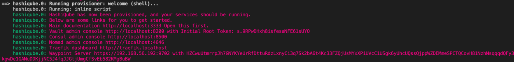

# HashiQube with Traefik and Nomad/Vault Integration

## About

This is a fork of the [`servian/hashiqube`](https://github.com/servian/hashiqube) repo.

It includes the following modifications:

1. Bootstraps Vault, Consul, Nomad, and Waypoint only
2. Uses [Traefik](traefik.io) instead of [Fabio](https://fabiolb.net) for load-balancing. The accompanying [Traefik job](hashicorp/nomad/jobs/traefik.nomad) is deployed during the Nomad provisioning process.
3. Configures Nomad to give it the ability to pull Docker images from private GitHub repos given a GitHub personal access token (PAT). This is optional (more on that below).
4. Configures Nomad/Vault integration so that you can use Nomad to pull secrets from Vault. See [`hashicorp/nomad.sh`](hashicorp/nomad.sh) and [`hashicorp/vault.sh`](hashicorp/vault.sh)
5. Includes an [OpenTelemetry Collector job](hashicorp/nomad/jobs/otel-collector.nomad).
6. Includes a sample [2048-game](hashicorp/nomad/jobs/2048-game.nomad).
7. Includes a Waypoint example.
## Pre-requisites

* [Oracle VirtualBox](https://www.googleadservices.com/pagead/aclk?sa=L&ai=DChcSEwjVuPag0oL0AhXFnrMKHRjODRYYABAAGgJxbg&ohost=www.google.com&cid=CAASEuRoonvAcnwV4Mde6j85eTiOEQ&sig=AOD64_1N8BIxbnQDEjTDYvtzMR78syE9Bg&q&adurl&ved=2ahUKEwiUpe6g0oL0AhVjTd8KHWTvAkEQ0Qx6BAgCEAE) (version 6.1.30 at the time of this writing)
* [Vagrant](https://www.vagrantup.com/) (version 2.2.19 at the time of this writing)
* [A GitHub Personal Access Token (PAT)](https://docs.github.com/en/authentication/keeping-your-account-and-data-secure/creating-a-personal-access-token)

## Quickstart

To get started:

1. Clone the repo

    ```bash
    git clone git@github.com:avillela/hashiqube.git
    ```

2. Configure the Docker plugin

    > **Note:** If you wish to skip this configuration, simply comment out [lines 46–52](hashicorp/nomad.sh#L46-L52) and lines [74–88](hashicorp/nomad.sh#L74-L88) in [`nomad.sh`](hashicorp/nomad.sh).

    The [`nomad.sh`](hashicorp/nomad.sh) file has some additional configuration which enables you to pull Docker images from a private GitHub repo. This is enabled in [lines 46–52](hashicorp/nomad.sh#L46-L52) in the docker stanza, telling it to pull your Docker repo secrets from `/etc/docker/docker.cfg`, which is configured in [lines 74–88](hashicorp/nomad.sh#L74-L88).

    [Line 79](hashicorp/nomad.sh#L79) expects a GitHub auth token, which is made up of your GitHub username and [GitHub PAT](https://docs.github.com/en/authentication/keeping-your-account-and-data-secure/creating-a-personal-access-token). It pulls that information from a file called `secret.sh`, located at `vagrant/hashicorp/nomad` on the guest machine (mapped to `hashiqube/hashicorp/nomad` on the host machine).

    For your convenience, you can create `secret.sh` on your host machine like this (assuming you're starting from the hashiqube repo root directory):

    ```bash
    cat hashicorp/nomad/secret.sh
    echo "export GH_USER=<your_gh_username>" > hashicorp/nomad/secret.sh
    echo "export GH_TOKEN=<your_gh_pat>" >> hashicorp/nomad/secret.sh
    ```

    Be sure to replace `<your_gh_username>` with your own GitHub username and `<your_gh_pat>` with your own GitHub PAT.

3. Install & Configure dnsmasq

    If you're using a Mac and are running into issues getting your machine to resolve `*.localhost`, see [DNS Resolution Issues with *.localhost](#dns-resolution-issues-with-localhost)


4. Start Vagrant

    ```bash
    cd hashiqube # if you aren't already there
    vagrant up
    ```

    Now wait patiently for Vagrant to provision and configure your VM.

    Once everything is up and running (this will take several minutes, by the way), you'll see this in the tail-end of the startup sequence, to indicate that you are good to go:

    

5. Access the Hashi tools

    The following tools are now accessible from your host machine

    * Vault: http://localhost:8200 (Get the login token by logging into the guest machine using `vagrant ssh` and running `cat /etc/vault/init.file | grep Root`)
    * Nomad: http://localhost:4646
    * Consul: http://localhost:8500
    * Traefik: http://traefik.localhost
    * Waypoint: https://${VAGRANT_IP}:9702 (Get the login token by running `cat ./hashicorp/waypoint/waypoint_user_token.txt` from repo root on the host machine)

    If you'd like to SSH into the HashiQube VM, you can do so by running the following from a terminal window on your host machine.

    ```bash
    vagrant ssh
    ```

6. Install the Nomad and Vault CLIs on your host machine

    If you’re using a Mac, you can install the Vault and Nomad CLIs via Homebrew like this:

    ```bash
    brew tap hashicorp/tap
    brew install hashicorp/tap/vault
    brew install hashicorp/tap/nomad
    ```

    If you’re not using a Mac, you can find your OS-specific instructions for Vault [here](https://medium.com/r/?url=https%3A%2F%2Fwww.vaultproject.io%2Fdownloads) and for Nomad [here](https://medium.com/r/?url=https%3A%2F%2Fwww.nomadproject.io%2Fdownloads). Note that these are binary installs, and they also contain the CLIs.

## Waypoint Notes and Gotchas

Waypoint requires a storage back-end. For this example, I used a MySQL DB as the back-end. This is why we deploy the [`my-sql.nomad`](hashicorp/nomad/jobs/my-sql.nomad) as part of the Nomad bootstrapping process. We also configure a  `host_volume` called `mysql` in `/etc/nomad/server.conf` on the VM. This is referenced by Waypoint when we run the install:

```
waypoint install -platform=nomad -nomad-dc=dc1 -accept-tos -nomad-host-volume="mysql"
```

Note how `-nomad-host-volume` points to `mysql`, which we defined in the nomad config.

Another thing worth mentioning is that you may notice after installing Waypoint, you'll see it running successfully in Nomad, but you'll also see the following error in the provisioning output following the Waypoint server install:

```
Error connecting to server: context deadline exceeded
```

This is fixed by running:

```
waypoint server bootstrap -server-addr=${VAGRANT_IP}:9701 -server-tls-skip-verify
```

I have no idea why we keep getting the first error, but the above command seems to fix things, so yay!

After Waypoint is bootstrapped, you can log in by:

```
waypoint login \
    -token=$(cat ./hashicorp/waypoint/waypoint_user_token.txt) \
    ${VAGRANT_IP}

waypoint context verify
waypoint context list
```

## Detailed How-To Guides

For detailed tutorials that use this repo, please see the following blog posts on Medium:
* [Just-in-Time Nomad: Running Traefik on Nomad with HashiQube](https://adri-v.medium.com/just-in-time-nomad-running-traefik-on-hashiqube-7d6dfd8ef9d8)
* [Just-in-Time Nomad: Running the OpenTelemetry Collector on Hashicorp Nomad with HashiQube](https://adri-v.medium.com/just-in-time-nomad-running-the-opentelemetry-collector-on-hashicorp-nomad-with-hashiqube-4eaf009b8382)
* [Just-in-Time Nomad: Configuring Nomad/Vault Integration on HashiQube](https://adri-v.medium.com/just-in-time-nomad-configuring-hashicorp-nomad-vault-integration-on-hashiqube-388c14cb070a)
* [Just-in-Time Nomad: Managing Nomad Application Deployments Using Waypoint on HashiQube](https://faun.pub/just-in-time-nomad-managing-nomad-application-deployments-using-waypoint-on-hashiqube-467952b23689)
* [Just-in-Time Nomad: Templating HashiCorp Nomad Jobs with Nomad Packs](https://adri-v.medium.com/just-in-time-nomad-templating-hashicorp-nomad-jobs-with-nomad-packs-b4fde6a2b7b8)
* [Just-in-Time Nomad: Running Temporal on Nomad](https://adri-v.medium.com/just-in-time-nomad-running-temporal-on-nomad-5fee139f37ea)

## Gotchas

### Unable to access guest machine IP

[Line 26](https://github.com/avillela/hashiqube/blob/72c05a59d41f4c1a3e68d51b1a91839399d086c2/Vagrantfile#L26) in the [`Vagrantfile`](Vagrantfile) from the original HashiQube repo sets the VM IP to `10.9.99.10`; however, I kept getting an error on vagrant up, so I changed the [VM IP on my Vagrantfile](https://github.com/avillela/hashiqube/blob/master/Vagrantfile#L26) to `192.168.56.100`. I’m running this on a Mac, so it may be a Mac-specific issue.

If your Vagrant VM starts up properly, but you find yourself unable to access the Waypoint UI, it might be due to an [IP address collision](https://superuser.com/questions/570261/cant-ping-to-vagrant-box/1016731#1016731) with another device on your network. This happened to me. I was happily using `192.168.56.100`, and then suddenly, it wasn’t working anymore. I had to switch my Vagrantfile to use `192.168.56.192` (I randomly picked it and prayed it would work 😅), and then it was all good.

### DNS Resolution Issues with *.localhost

If you're using a Mac and are running into issues getting your machine to resolve `*.localhost`, you can try one of two things:
1. Wildcard resolution with [`dnsmasq`](https://en.wikipedia.org/wiki/Dnsmasq)
2. Manually add entries to `/etc/hosts`

#### Solution 1: Wildcard Resolution with dnsmasq

1. Install dnsmasq

    ```bash
    brew install dnsmasq
    ```

2. Configure

    Copy the sample config file to `/usr/local/etc/dnsmasq.conf`, and add `address=/localhost/127.0.0.1` to it:

    ```bash
    cp $(brew list dnsmasq | grep dnsmasq.conf) /usr/local/etc/dnsmasq.conf
    echo "address=/localhost/127.0.0.1" >> /usr/local/etc/dnsmasq.conf
    ```

    Restart `dnsmasq` services
    
    ```bash
    sudo brew services restart dnsmasq
    ```

    Add a resolver to allow OS X to resolve requests from `*.localhost`
    
    ```bash
    sudo mkdir /etc/resolver
    sudo touch /etc/resolver/localhost
    sudo echo "nameserver 127.0.0.1" >> /etc/resolver/localhost
    ```

3. Test
    
    Even though foo.localhost doesn’t exist, we should now be able to ping it, since it will map to `127.0.0.1`, as per our configs above.
    
    ```bash
    ping foo.localhost
    ```

    Result:
    
    ```
    PING foo.localhost (127.0.0.1): 56 data bytes
    64 bytes from 127.0.0.1: icmp_seq=0 ttl=64 time=0.035 ms
    64 bytes from 127.0.0.1: icmp_seq=1 ttl=64 time=0.111 ms
    64 bytes from 127.0.0.1: icmp_seq=2 ttl=64 time=0.092 ms
    ...
    — — foo.localhost ping statistics — -
    3 packets transmitted, 3 packets received, 0.0% packet loss
    round-trip min/avg/max/stddev = 0.035/0.079/0.111/0.032 ms
    ```

#### Solution 2: Manual entries to `/etc/hosts`

On the most part, `dnsmasq` works pretty well for me; however, it was acting super finnicky when I tried configuring gRPC endpoints on Traefik, so I had to disable it, and instead manully add entries to my `/etc/hosts` file.

1. Disable `dnsmasq`, if it's running:

    ```bash
    sudo brew services stop dnsmasq
    ```

2. Append the entries below to your `/etc/hosts` file.

    Take note of the fact that the IP address you're using is the IP address of your HashiQube VM.

    ```bash
    # For HashiQube
    192.168.56.192  traefik.localhost
    192.168.56.192  2048-game.localhost
    192.168.56.192  temporal-web.localhost
    192.168.56.192  temporal-app.localhost
    192.168.56.192  otel-collector-http.localhost
    192.168.56.192  otel-collector-grpc.localhost
    ```

    >**NOTE**: You'll have to keep manually adding entries to `/etc/hosts` each time you need a specific `*.localhost` entry. For example, if I need `foo.localhost` to resolve, I would add this line to the end of `/etc/hosts`: `192.168.56.192  foo.localhost`
